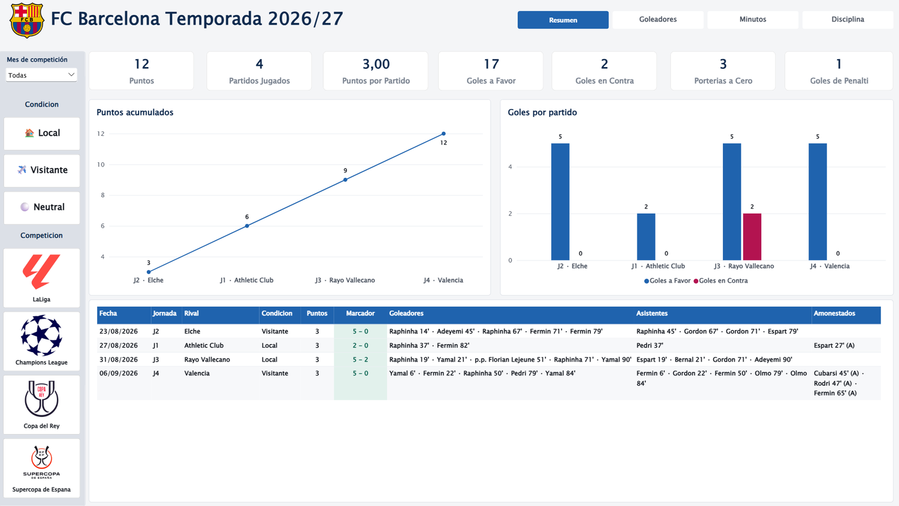
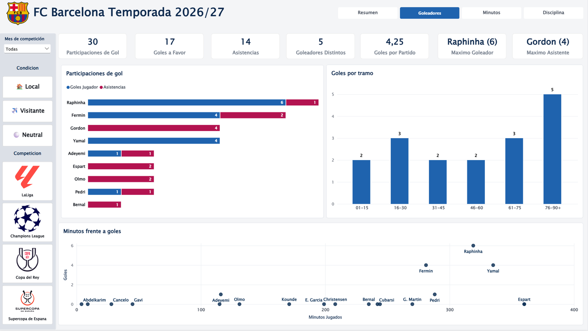

# FC Barcelona · Temporada 2026/27 — Power BI

Modelo de datos e informe de Power BI para seguir una temporada completa del
FC Barcelona a nivel de evento: cada gol, asistencia y tarjeta con su minuto
exacto, en LaLiga, Champions League, Copa del Rey y Supercopa de España.

> **En curso.** El modelo y las cuatro páginas del informe están terminados; los
> partidos se van cargando según avanza la temporada.



---

## La decisión que sostiene el proyecto

Un informe de fútbol se puede montar con una fila por partido: resultado, goles a
favor y en contra. Es lo rápido, y también el techo del proyecto — con esa
granularidad no hay forma de responder *en qué minuto marcamos* ni *cuántos
minutos lleva cada jugador*.

Aquí la tabla de hechos guarda **una fila por evento**: gol, asistencia o tarjeta,
con su minuto, su partido y su protagonista. Todo lo demás —los KPIs, los tramos
del partido, los minutos por jugador— sale de agregar esa tabla con medidas DAX.
El coste es cargar más detalle; el beneficio es que preguntas que no estaban
previstas se contestan añadiendo una medida, sin rehacer el modelo.

La segunda decisión fue **descartar API y scraping**. Una plantilla de carga
manual en Excel no depende de claves que caducan ni de webs que cambian de
estructura a mitad de temporada, y para un volumen de una temporada el coste de
carga es asumible.

## El informe

| Página | Qué responde |
|---|---|
| **Resumen** | Puntos, partidos, goles a favor y en contra, porterías a cero, y el detalle partido a partido con goleadores, asistentes y amonestados |
| **Goleadores** | Participaciones de gol por jugador separando goles y asistencias, reparto de goles por tramo de quince minutos y minutos jugados frente a goles |
| **Minutos** | Minutos por jugador y competición |
| **Disciplina** | Tarjetas por jugador y minuto en el que llegan |

Filtros comunes a todo el informe: competición, condición (local, visitante o
neutral) y mes.



## Modelo

Esquema en estrella sobre la tabla de eventos, con calendario y dimensiones
compartidas, de modo que un mismo filtro de fecha o de competición mueve todas
las páginas a la vez.

<!-- REVISAR: ajusta esta lista a los nombres reales de tus tablas antes de publicar -->

- **Hechos:** eventos de partido (gol, asistencia, tarjeta) con minuto, partido y jugador
- **Hechos:** partidos (fecha, rival, condición, competición, marcador, puntos)
- **Dimensiones:** calendario, jugadores, competiciones

## Estructura del repositorio

```
├── README.md
├── img/                  Capturas del informe
├── data/                 Plantilla de carga en Excel
└── pbix/                 Archivo de Power BI
```

## Cómo usarlo

1. Abre la plantilla de Excel y añade los partidos y sus eventos siguiendo las
   columnas existentes: un evento por fila, con su minuto.
2. Abre el `.pbix` en Power BI Desktop y actualiza. Los visuales y las medidas ya
   están montados.

## Stack

`Power BI Desktop` · `DAX` · `Power Query` · `Excel`

---

## English

Power BI data model and report tracking a full FC Barcelona season at **event
level** — every goal, assist and card with its exact minute, across LaLiga,
Champions League, Copa del Rey and Supercopa de España.

The design decision that carries the project is the grain: one row per event
instead of one row per match. That is what makes minutes per player, goal
distribution by fifteen-minute period, and booking timing possible from the same
model. Data is loaded through a manual Excel template rather than an API or
scraping, so the project depends on no keys and no third-party site structure.

Work in progress: the model and the four report pages are finished; matches are
loaded as the season goes on.

---

**Miguel Ángel Rosingana Martín** · Data Analyst · Madrid
[Portfolio](https://miguelangelrosingana.github.io/portfolio/) ·
[LinkedIn](https://www.linkedin.com/in/miguel-angel-rosingana) ·
[miguel.rosin@gmail.com](mailto:miguel.rosin@gmail.com)
